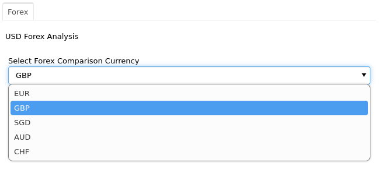
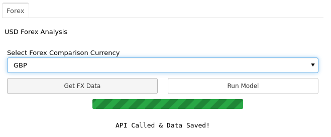
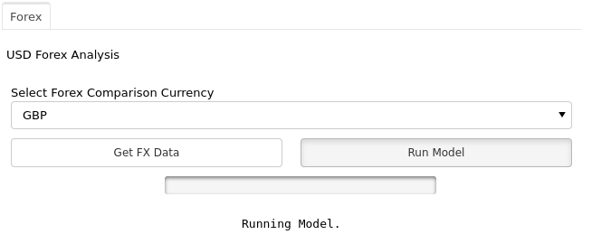
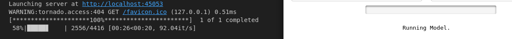
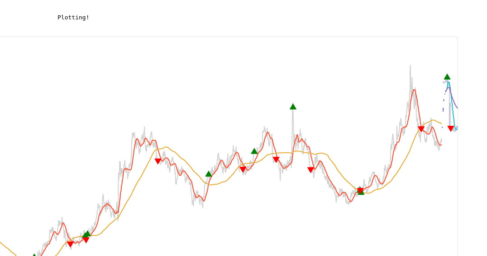

# Module 16 - Project 2

This is the page for the sixteenth module of the Fintech Bootcamp course, covering Project 2.

This page is a continuation of my GitHub learning structure for this course.

## Modules Notes

Above you will see the *^*.ipynb file for this homework

There is also a Resources folder with called data used.

# Project 2 - USD Forex Analysis & Prediction Tool

## Contents

* [Application Overview](#application-overview)
* [Data Sources & Collection](#data-sources--collection)
* [Data Preparation](#data-preparation)
* [Machine Learning Methods](#machine-learning-methods)
* [Application Usage](#application-usage)
* [Results](#results)
* [Conclusion](#conclusion)
* [Back to Fintech Home](#back-to-fintech-home)

## Application Overview

I put together a Forex Analysis tool, using USD as the base currency with the option to compared against 5 other currencies. It runs machine learning models against the data, provides accuracy output and plots the results on a graph with buy/sell trade signals.

## Data Sources & Collection

I created 2 APIs for source data. The first to call yfinance for the forex data from 2006 to 2023, which encapsulated some major events in the world including the GFC, Covid pandemic and the Ukraine war. This provided daily Open, High, Low and Close values for the time period. Unfortunately there was no Volume data. 

Instead, I set up the second API to call 'FRED'. FRED is the Federal Reserve Economic Data API for the Federal Reserve Bank of St. Louis in the USA. I used it to collect observations on Consumer Price Index for All Urban Consumers and the Bank Prime Loan Rate in the USA. I wanted to see how the models worked using inflation and interest rate figures as features against forex rates.

## Data Preparation

As always, data preparation took a lot of work. Particularly with different APIs with different formats and outputs.

With the forex data I dropped emtpy and duplicate columns, set the index to date and saved to csv file.

With the FRED data, it took a bit more work to drop all the useless information, extract the useful observation data and format it to align with the forex data as they give you all the data they have from the beginning of records. I saved both Bank Loan Rate (BLR) and Consumer Price Index (CPI) prepared data into their respective csv files.

Typically I would not use csv files and would put this information straight into an SQL database but I had environment issues and time pressures this week.

## Machine Learning Methods

To start the Machine Learning process, the csv files are called, including the BLR and CPI files as well as the currency chosen for the API call.

The CPI data is provided monthly from the FRED API, so I had to expand the dataframe to match the BLR data. I did this by creating a new daily CPI dataframe using the start and end date from the original date and forward filling the same data from the 1st of each month.

I then created another dataframe with the original close price and added a signal indicator column using a rolling window of 2, cycling through the Close prices making comparisons, to be used as a target.

Next I merged the forex and FRED values, specifically: Open, High, Low, Close, Rate and CPI. 

I created another dataframe with the original 'Close' and scaled them using MinMaxScaler with 'Close' as y.

The next stage was to build the machine learning model. Originally I did this using TimeSeriesSplit but the results were not ideal. For this reason I changed to a rolling origin validation which is meant to have better results.

## Application Usage

Here are some screenshots showing how the application is used.

Select a currency 
 

Get FX Data 
 

Run Model 
 

I attempted to implement a progress bar in the app. While it worked inside VS Code's jupyter notebook engine I was unable to get it to run properly in the app. I attempted dual thread operations to get it working without any luck. There is a limitation of either my ability or the widget to operate in the manner, likely the former! :D 

Progress Bar 
 

You can see the predictions are plotted after the historical data.

Plot Predictions 
 

## Results

The first model, using TimeSeriesSplit, returned a Mean Average Accuracy typically around -22. This is well below 0 which means it performed worse than guessing.

After changing tact and using a rolling origin validation method, I saw far better accuracy results.

Finally the application produces a plot with historical closing price and predicted future closing prices along with buy and sell signals.

I was working on a neural network and prophet model, but I didn't quite get them working and ran out of time.

## Conclusion

Overall this was quite challenging in the time, but I am pretty happy with how far I got and what I've learned this week. There is a lot further that this could be taken. I need more backtesting, more models and more averages. The moving average plots aren't joined between historical and predicted, so that is something that would need resolving. If I had more time I would look to add more feature data points, run more model comparisons and integrate more user interface functions into the application. Examples such as configurable dates, machine learning models and windows such as adjusting moving averages or the future prediction time period. More graph indicators would be good and of course additional currencies.

## Back to Fintech Home

* [Fintech Bootcamp Home](https://github.com/d4np3/fintech-home)

